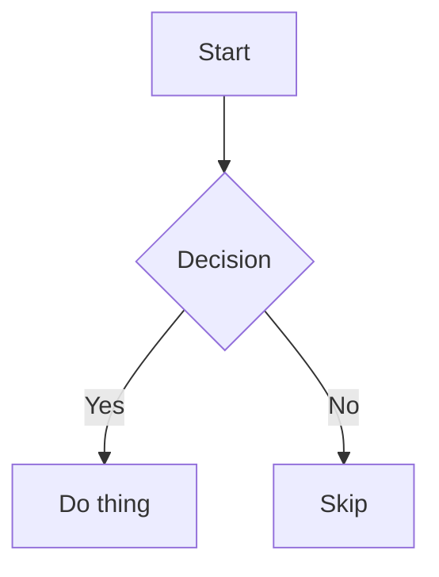

# GitHub Markdown to HTML

Convert `.md` files to **fully self-contained** `.html` files styled like GitHub's markdown renderer, including rendered mermaid diagrams.

## Usage

Run the bundled script:

```bash
node ${CLAUDE_PLUGIN_ROOT}/skills/md-to-html/scripts/md-to-html.mjs <input.md> [output.html]
```

- If no output path is given, writes `<input-name>.html` next to the source file.
- Requires Node.js (no other dependencies — `marked` is auto-installed on first run).

## What it does

1. Reads the `.md` file
2. Parses it with `marked` (full GFM spec: tables, strikethrough, autolinks, task lists)
3. Detects ```` ```mermaid ```` fenced blocks and rewrites them as `<pre class="mermaid">`
4. Wraps the HTML in `<article class="markdown-body">`
5. Inlines `github-markdown-css` v5.8.1 (auto light/dark theme via `prefers-color-scheme`)
6. Inlines bundled `mermaid.min.js` **only when** the source contains mermaid blocks, and initialises it with a theme matching the user's color scheme
7. Writes a single self-contained `.html` file (no external CSS/JS, no network requests)

## Mermaid

Fenced blocks tagged `mermaid` are rendered client-side:

````markdown

````

- The mermaid bundle (~3 MB) is inlined only when at least one mermaid block is present, so plain markdown stays lean.
- Theme follows `prefers-color-scheme`; the page reloads on theme change to re-render diagrams.

## Tech details

- **marked** is a fast CommonMark/GFM parser with `gfm: true` for full GitHub Flavored Markdown support.
- **github-markdown-css** is bundled in `assets/github-markdown.min.css` for offline use.
- **mermaid** is bundled as a single UMD-style file in `assets/mermaid.min.js` that exposes `globalThis.mermaid`.

## Updating bundled assets

```bash
# github-markdown-css
curl -sL "https://cdnjs.cloudflare.com/ajax/libs/github-markdown-css/<VERSION>/github-markdown.min.css" \
  -o ${CLAUDE_PLUGIN_ROOT}/skills/md-to-html/assets/github-markdown.min.css

# mermaid (any v11.x)
curl -sL "https://cdn.jsdelivr.net/npm/mermaid@<VERSION>/dist/mermaid.min.js" \
  -o ${CLAUDE_PLUGIN_ROOT}/skills/md-to-html/assets/mermaid.min.js
```
